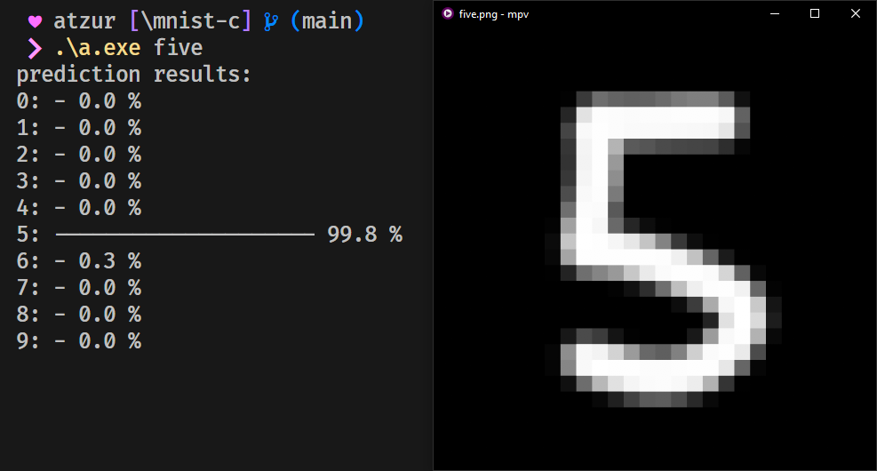

# mnist-c
C implementation of a neural network for classification.


## Performance
Using default settings training takes about 1.5s per epoch on my Ryzen 5 2600.
- **[MNIST Handwritten Digits dataset](http://yann.lecun.com/exdb/mnist/)**: ~97% accuracy
- **[Zalando Fashion-MNIST dataset](https://github.com/zalandoresearch/fashion-mnist)**: ~85% accuracy

## Architecture
Three fully connected layers (64-32-10 by default) with sigmoid activations in between, though this is trivially modifiable. 

## Usage
### Training
```sh
git clone https://github.com/atzuur/mnist-c
cd mnist-c
make # optionally add `CC=clang EXTRA="-fuse-ld=lld"` to use clang
./a.exe train
```
### Prediction
1. Draw a 28x28 MNIST-like image (see [demo](img/demo.png))
2. Convert to raw floating point using e.g. [FFmpeg](https://ffmpeg.org):
```sh
ffmpeg -v error -i YOUR_IMAGE.png -pix_fmt grayf32 -f rawvideo YOUR_IMAGE
```
3. Run prediction using the model:
```sh
./a.exe YOUR_IMAGE
```
